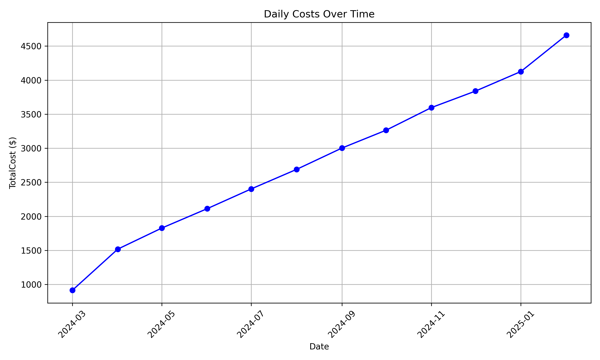
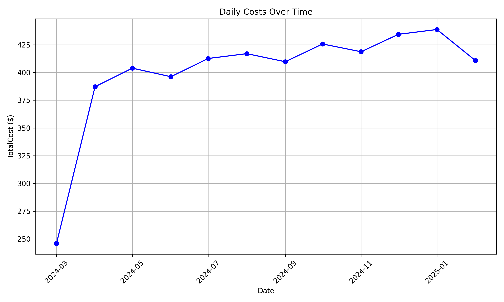

# Cost Analysis Report

## Objectives of this cost analysis report

Provide cost information for the provided capabilities if they were to be moved into a cloud environment.

These will incur direct, indirect, and any opportunity costs. The direct costs will be compute, storage, and networking. For outbound data transfer, we will estimate the cost of serving the workload to consumers from a single Avaiability Zone.

This version of the estimator takes into account on-demand pricing but future versions will provide stimates for reserved instances that are not paid up front.

## Elastic Cost Analysis cost analysis

This is the description of the elastic parser and will provide any up front context

## Complete costs

| Month | Total Costs
|---|---|
|2024-03|913.5071578947368

| Month | Total Costs
|---|---|
|2024-04|1518.33

| Month | Total Costs
|---|---|
|2024-05|1827.1689032258064

| Month | Total Costs
|---|---|
|2024-06|2112.33

| Month | Total Costs
|---|---|
|2024-07|2402.007612903226

| Month | Total Costs
|---|---|
|2024-08|2689.426967741935

| Month | Total Costs
|---|---|
|2024-09|3003.33

| Month | Total Costs
|---|---|
|2024-10|3264.2656774193547

| Month | Total Costs
|---|---|
|2024-11|3597.33

| Month | Total Costs
|---|---|
|2024-12|3839.104387096774

| Month | Total Costs
|---|---|
|2025-01|4126.5237419354835

| Month | Total Costs
|---|---|
|2025-02|4660.710142857143

| Month | Total Costs
|---|---|
|2024-03|245.8410315789474

| Month | Total Costs
|---|---|
|2024-04|387.18300000000005

| Month | Total Costs
|---|---|
|2024-05|403.9077290322581

| Month | Total Costs
|---|---|
|2024-06|396.18300000000005

| Month | Total Costs
|---|---|
|2024-07|412.61740645161296

| Month | Total Costs
|---|---|
|2024-08|416.97224516129035

| Month | Total Costs
|---|---|
|2024-09|409.68300000000005

| Month | Total Costs
|---|---|
|2024-10|425.6819225806452

| Month | Total Costs
|---|---|
|2024-11|418.68300000000005

| Month | Total Costs
|---|---|
|2024-12|434.39160000000004

| Month | Total Costs
|---|---|
|2025-01|438.7464387096775

| Month | Total Costs
|---|---|
|2025-02|410.7140142857143

## Application costs

### Forecasting
c

## Projected cost for ElasticHotStorage

| Month | Projected Compute Cost | Projected Storage Cost
|---|---|---|
|2024-03|679.74|233.76|
|2024-04|1073.28|445.05|
|2024-05|1109.06|718.11|
|2024-06|1073.28|1039.05|
|2024-07|1109.06|1292.95|
|2024-08|1109.06|1580.37|
|2024-09|1073.28|1930.05|
|2024-10|1109.06|2155.21|
|2024-11|1073.28|2524.05|
|2024-12|1109.06|2730.05|
|2025-01|1109.06|3017.47|
|2025-02|1001.73|3658.98|

### Graph of costs

## Projected cost for ElasticColdStorage

| Month | Projected Compute Cost | Projected Storage Cost
|---|---|---|
|2024-03|240.04|5.8|
|2024-04|379.01|8.17|
|2024-05|391.64|12.27|
|2024-06|379.01|17.18|
|2024-07|391.64|20.98|
|2024-08|391.64|25.33|
|2024-09|379.01|30.67|
|2024-10|391.64|34.04|
|2024-11|379.01|39.67|
|2024-12|391.64|42.75|
|2025-01|391.64|47.1|
|2025-02|353.74|56.97|

### Graph of costs

## Assumptions
This projection assumes the applications communicating will be using private IP communications and not public Elastic IPs, which would incur fees. 
